# How LLMs Actually Work — Gen AI Introduction

## Key Concepts and Learning Objectives

**Key Terms and Concepts:**
- **Transformer** — The neural network architecture underlying all modern generative AI models, introduced in the 2017 paper "Attention Is All You Need"
- **Token** — A word or subword unit that the model processes; text is broken into tokens before the model can work with it
- **Token Embedding** — A high-dimensional vector representing a token's position in semantic space, where locations carry meaning
- **Attention** — The mechanism that allows preceding words to influence the current word's representation by averaging meaning from contextually relevant tokens
- **Multi-Layer Perceptron (MLP)** — The component within each decoder stack that stores learned world knowledge in weight matrices; described as a "fuzzy JPEG of the world"
- **Decoder Stack** — A paired Attention + MLP layer; models use many stacks in sequence, each refining the token representations further
- **Autoregressive Generation** — The process by which models produce responses one token at a time, feeding each prediction back into the context
- **End of Sequence Token** — A special token the model predicts to signal it has finished generating
- **Context Window** — The total amount of text (measured in tokens) the model can consider at once; modern models support 200K to 1M+ tokens
- **Reasoning Model** — A model that produces internal "thinking tokens" before responding, enabling more considered answers
- **Alignment / Post-training** — Additional training after pre-training that teaches the model to follow instructions, respond safely, and behave as a helpful assistant
- **Tool Use** — The ability of a model to call external tools (search, calculators, code execution) to augment its capabilities beyond what is stored in its weights
- **Agent** — A model plus tools plus a loop with autonomy, capable of working on complex tasks over extended periods
- **Skills** — Human-authored Markdown documents that provide domain-specific process knowledge to guide how a model performs particular tasks
- **MCP (Model Context Protocol)** — A standardized protocol for models to request data or processing from external services without custom API integrations
- **RAG (Retrieval-Augmented Generation)** — An older approach for injecting external knowledge into context, now less commonly used as context windows have grown

**Learning Objectives:**
1. Understand the fundamental architecture of decoder transformer models (tokenization, embeddings, attention, MLPs, and autoregressive generation)
2. Explain why LLMs produce plausible but not necessarily correct outputs, and the role of the "fuzzy JPEG" analogy
3. Distinguish between pre-training, alignment, and reasoning models
4. Understand how tools, context windows, and skills improve model reliability and capability
5. Define what an agent is and how it differs from a simple chat interaction

---

## Introduction: The Decoder Transformer

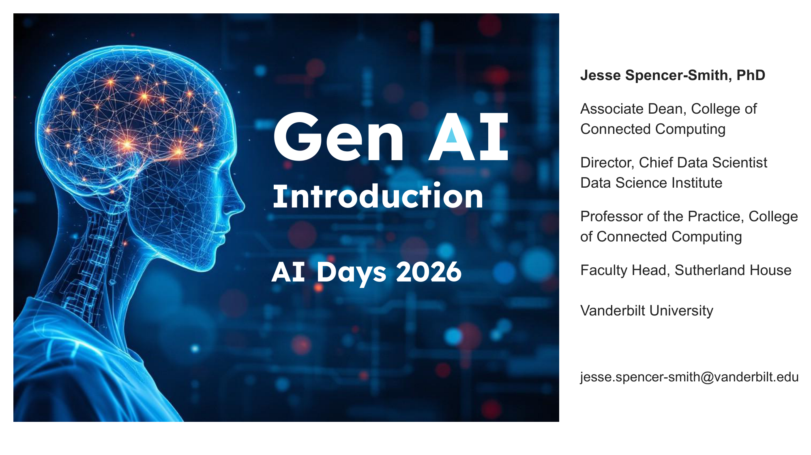

This session, presented by Jesse Spencer-Smith at the AI Days 2026 event at Vanderbilt University, dives into the technical foundations of how large language models actually work. The goal is to build a mental model of the architecture so that attendees can make better decisions about how and when to use these tools.

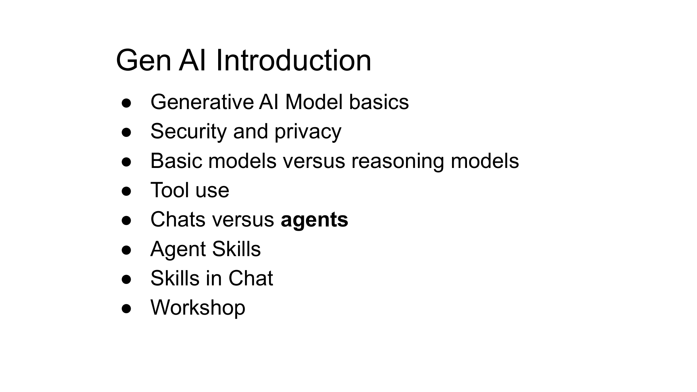

The session covers generative AI model basics, security and privacy considerations, basic models versus reasoning models, tool use, chats versus agents, agent skills, and skills in chat -- followed by a workshop.

> "By understanding how the models work, you'll actually have a much better handle on what are good decisions and bad decisions about how to use the models. And you'll also understand some of the oddities about working with the models that might not have been understandable or clear before." -- Jesse Spencer-Smith

---

## AI Over the Years

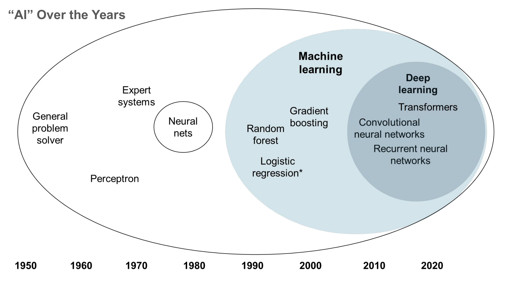

Before diving into the transformer architecture, it is helpful to situate generative AI within the broader history of artificial intelligence. AI research stretches back to the 1950s with general problem solvers, then expert systems in the 1960s-70s, and neural nets in the 1970s-80s. Machine learning techniques like logistic regression, random forests, and gradient boosting emerged from the 1990s through the 2000s. Deep learning -- including convolutional neural networks, recurrent neural networks, and ultimately transformers -- represents the most recent wave, beginning around 2010. Generative AI and AI agents sit at the frontier of this deep learning era.

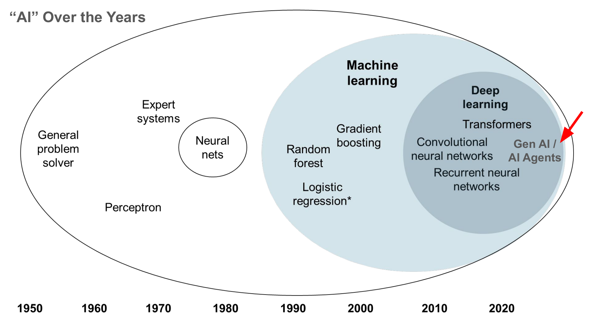

---

## The Transformer Architecture: From Context to Next Word

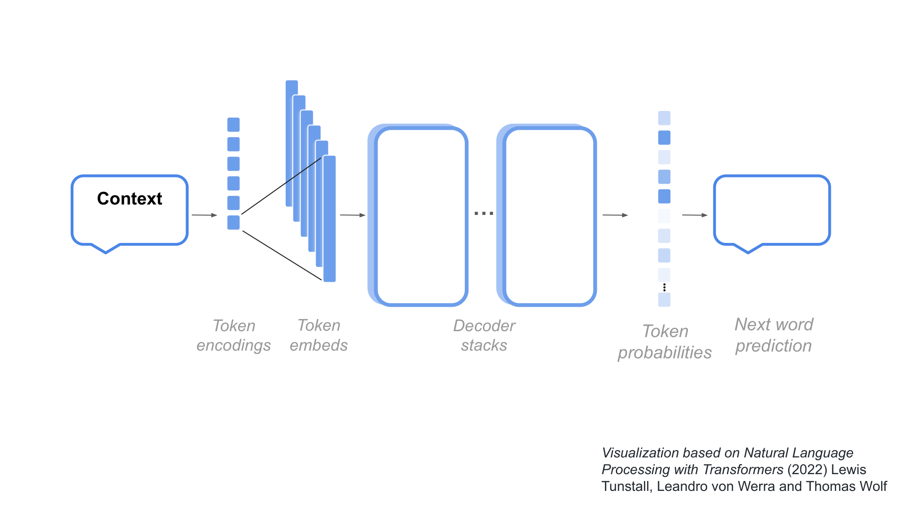

Generative AI models are deep learning models. This is fundamentally different from traditional software: there is no hand-written code executing rules. Instead, there is a deep neural network that has learned patterns from data.

The architecture flows in a clear pipeline:

1. **Context** -- This is where you put your chat input. You might type a question, upload a document, or provide instructions.
2. **Token Encodings** -- The input text is broken into tokens (words or subwords). Each token is assigned a numerical ID from a fixed vocabulary decided before training.
3. **Token Embeddings** -- Each token ID is mapped to a high-dimensional vector representing its initial position in semantic space.
4. **Decoder Stacks** -- The embeddings pass through multiple stacks, each containing an Attention layer and an MLP layer.
5. **Token Probabilities** -- After all stacks, the model produces a probability distribution over possible next tokens.
6. **Next Word Prediction** -- One token is selected (with some noise added), and the process repeats.

> "Funny thing about deep learning models, they can only deal with numbers. Ever." -- Jesse Spencer-Smith

---

## Token Embeddings: Meaning as Location in Space

The concept of token embeddings is central to understanding how these models work. When text is tokenized and each token is mapped to an embedding, it lands at a specific location in a high-dimensional space -- potentially thousands of dimensions.

The crucial insight is that **locations in this space have meaning**. Words with similar meanings cluster near each other. The classic example: the word "king" sits in a region near "royalty," "monarch," "queen," "president," and "leader."

Even more remarkable, you can do arithmetic in this space:

- **King - Man** = an "ungendered king" concept (ruler, royalty, crown)
- **King - Man + Woman** = Queen

> "The locations have meanings. And the tokens, the first guess of what they are, land exactly there. Because it's their location in the space, it's a vector." -- Jesse Spencer-Smith

This embedding space with thousands of dimensions allows the model to capture subtle distinctions of meaning that would be impossible in lower-dimensional representations.

---

## Autoregressive Generation: One Word at a Time

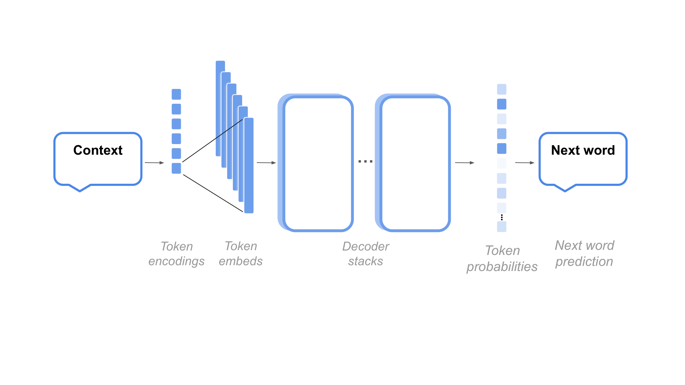

The model only ever predicts **one token at a time**. This seems at odds with our experience of getting long, flowing responses, but the mechanism is simple: the model predicts a word, appends it to the context, and reruns the entire pipeline. This is called **autoregressive generation**.

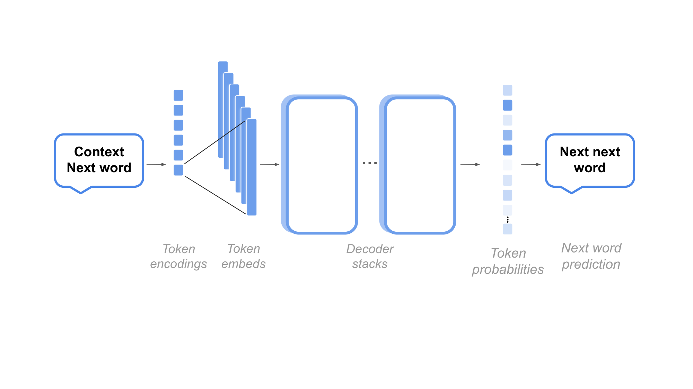

A small amount of noise is added to the token selection process rather than always choosing the most probable token. This prevents the model from producing repetitive, deterministic output.

The model knows when to stop because it can predict a special **end-of-sequence token**. When this token is selected, generation halts.

> "When models are responding to you, this is called autoregressive. The models are walking a response. I choose this word, I choose the next, I choose this word." -- Jesse Spencer-Smith

---

## Inside the Decoder Stack: Attention and MLPs

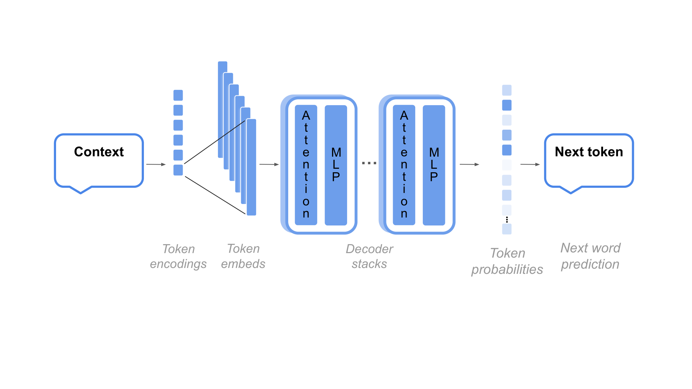

Each decoder stack contains two key components:

### Attention: Context Shapes Meaning

**Attention** is the mechanism by which preceding words influence the current word's representation. Consider the sentence: *"She looked across the board and said, triumphantly, King Me."*

The word "king" initially lands in a region of semantic space near royalty and monarchy. But in this sentence, "king" is a verb used in the context of a board game. The attention mechanism draws from the meanings of "board," "triumphantly," and the verb-like usage to **move** the embedding of "king" toward a completely different region -- one associated with gaming, winning, and checkers.

> "Attention is the averaging of the information to get you in about the right place." -- Jesse Spencer-Smith

### MLP: The Knowledge Store

The **multi-layer perceptron** (MLP) is where the model's world knowledge resides. After attention repositions the token, the MLP further enriches and refines the meaning based on learned knowledge. In the checkers example, the MLP provides the knowledge that "king me" in the context of a board game with winning relates specifically to checkers.

Each stack refines the representation further. After passing through many stacks, the model has transformed the initial rough token embedding into a richly contextualized representation that can make an accurate next-word prediction.

> "Attention is the averaging of the information to get you in about the right place. MLP, this is called the multi-layer perceptron, a wonderful 50-cent word." -- Jesse Spencer-Smith

---

## The Formal Algorithm

At one point during the session, the presenter pulled up the actual pseudocode for a decoder transformer from the paper "Formal Algorithms for Transformers."

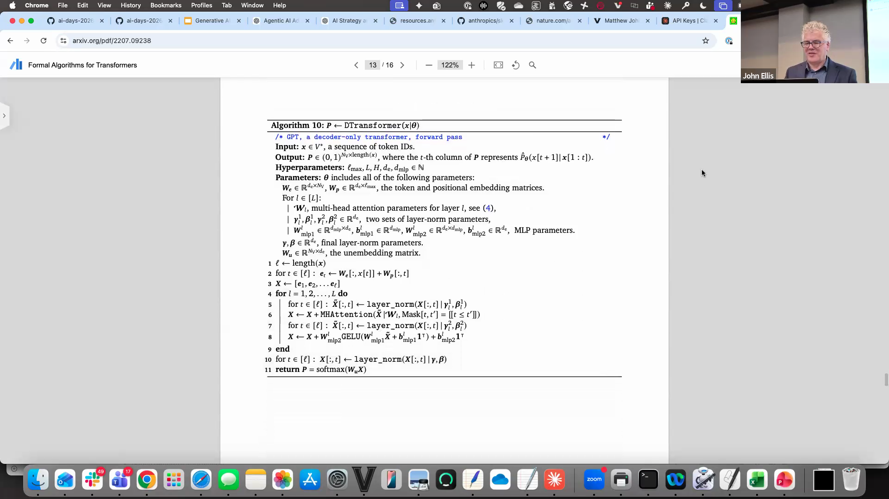

This is Algorithm 10 from the paper, representing the complete forward pass of a decoder-only transformer (i.e., ChatGPT's architecture). The entire algorithm fits on a single page.

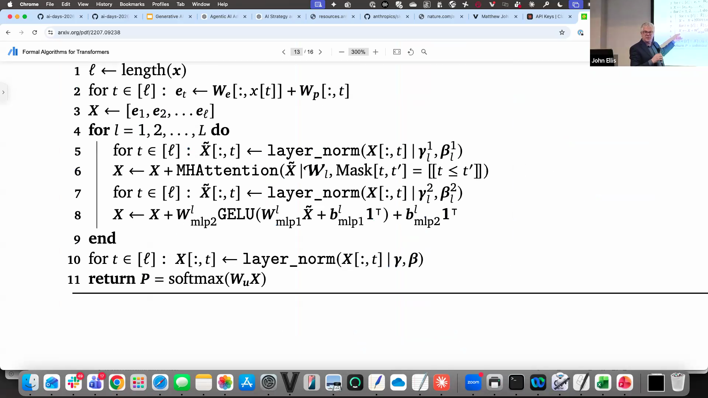

Line 8 of the algorithm is particularly important -- it represents the MLP computation, the dense two-layer feed-forward network where world knowledge is stored. The knowledge exists in **weight matrices**, not as stored text or a database. There are no words or specific data to look up; instead, the model performs mathematical operations that enrich the token representations based on learned patterns.

> "Algorithm 10 of the Formal Algorithms for Transformers paper -- you are looking at ChatGPT. This is all of it. This is it." -- Jesse Spencer-Smith

> "When I say that there's not actually code there, that's what I mean. Instead, that knowledge that we're talking about, that knowledge of the world, is in line 8." -- Jesse Spencer-Smith

---

## Large Language Models: What Makes Them "Large"

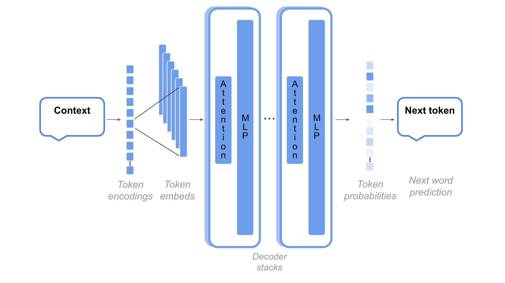

When we say "large" language model, we literally mean the MLPs are larger and can store more information. The MLP knowledge store is described as a **"fuzzy JPEG of the world"** -- a lossy compression of everything the model was trained on.

A larger MLP is like a higher-resolution JPEG: it can represent more detail, more knowledge, and more nuance. Large language models achieve this by having:
- More decoder stacks
- Bigger attention mechanisms
- Wider, deeper MLPs with more parameters

The largest models have on the order of 500 billion to a trillion parameters -- numbers that represent the learned knowledge of the world.

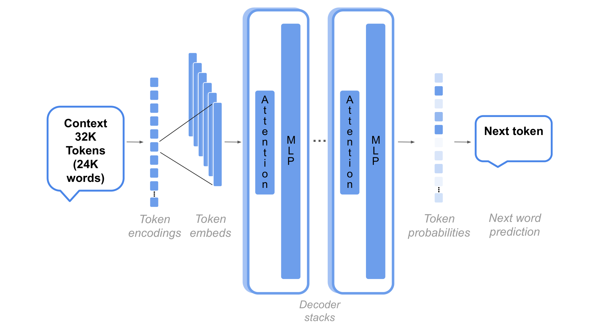

Small language models use the same architecture but with fewer parameters. They have less world knowledge (a blurrier JPEG) and fewer capabilities, but they can run on a laptop or phone.

---

## Self-Supervised Learning: How Models Are Trained

To demonstrate how models learn, the presenter conducted an interactive exercise using the opening line of Zora Neale Hurston's *Their Eyes Were Watching God*:

*"Ships at a distance have every man's wish on ______."*

The audience was asked to predict the next word. The responses revealed three layers of knowledge required:

1. **Syntax** -- Everyone guessed a noun, because the word follows a preposition ("on"). The model must learn grammatical structure.
2. **Semantics** -- Every noun chosen related to the sentence's meaning: "shore," "star," "deck," "board." The model must learn what concepts relate to what.
3. **Style and world knowledge** -- The best answer is "board" because it is more poetic and fits Hurston's literary style. The model must learn about writing styles, authors, and cultural context.

This exercise is precisely the task used to train LLMs: **predict the next token**. This is called **self-supervised learning** because the training data provides its own labels -- the next word in the text is always the answer.

All the knowledge needed to make accurate predictions (grammar, semantics, style, world knowledge) gets stored in the MLPs -- not as facts or text, but as learned patterns in the weight matrices.

> "This is called self-supervised learning. This is how the models are trained. It has to learn about everything that's carried, all the information which is carried, in order to learn how to guess that next word." -- Jesse Spencer-Smith

---

## The "Fuzzy JPEG" Problem: Hallucination and Accuracy

The MLPs store a compressed representation of the training data. This has profound implications:

- The model was trained on text from the internet, which includes incorrect, biased, and contradictory information
- The knowledge is not a database that can be queried or corrected -- it is distributed across billions of parameters
- Models can be aligned to respond more safely, but the underlying learned representations remain unchanged

> "It is a mirror held up to ourselves. And everything which we have written and created, it's probably trained on, so all that stuff is there." -- Jesse Spencer-Smith

When people say models "hallucinate," the reality is more fundamental:

> "When people say that the models are problematic because they hallucinate, the bad news is -- that's all it ever does. It is always and only hallucinating." -- Jesse Spencer-Smith

The model always produces **plausible** output -- text with high probability given the context. Without additional tools, it can only draw on its fuzzy JPEG of the world. This is why asking a tool-free model to produce specific citations often yields plausible-sounding but non-existent references: the author is about right, the title is about right, the journal is about right -- but the paper does not exist.

---

## Context Windows: The Path to Better Answers

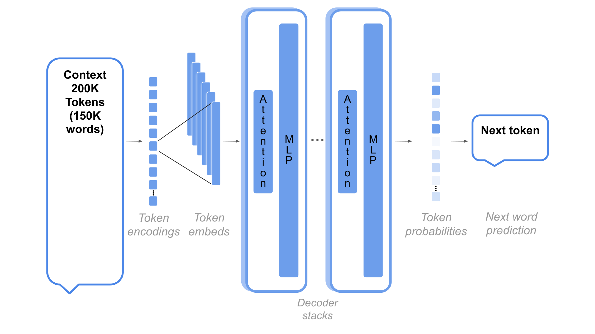

An important development over the past few years is the dramatic growth of context windows. Modern models support:
- **8K tokens** (early models)
- **32K tokens** (~24K words)
- **128K tokens** (~96K words)
- **200K tokens** (Claude)
- **1 million tokens** (Claude, Gemini) -- enough for dozens of chapters, multiple papers, and hours of video

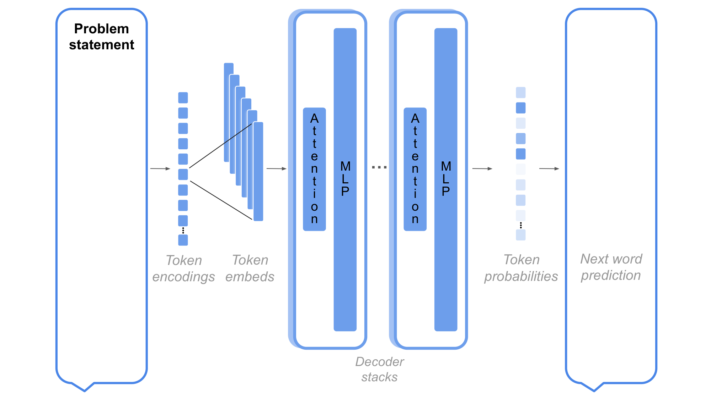

The key insight is that if the information exists in the context window, the **attention mechanism** can draw from it and produce much better answers. This is why providing relevant documents, data, and background information in the prompt dramatically improves model performance.

---

## Reasoning Models: Thinking Before Answering

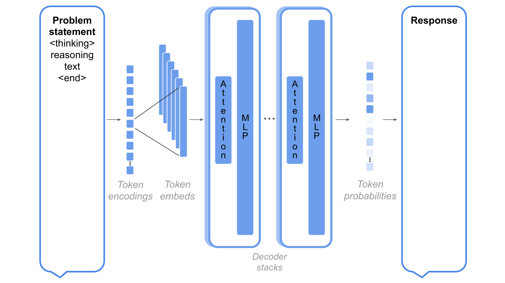

Until about a year ago, all models were like an eager student who blurts out an answer before the question is finished -- immediate, unconsidered responses. **Reasoning models** changed this by introducing an internal monologue.

When given a difficult question, a reasoning model:
1. Produces a special **thinking token** that enters a reasoning mode
2. Considers the question, evaluates potential responses, and reasons through the problem
3. Produces an **end-thinking token** when ready
4. Generates the actual response

> "The thinking token is the AI equivalent of the hand. Hold on." -- Jesse Spencer-Smith

The presenter described this reasoning as "McReasoning" -- basic, not deeply advanced, but often sufficient to get the job done. Modern models can flexibly switch between immediate response and thinking mode based on the difficulty of the question.

The key mechanism is still the same: the thinking process generates text that gets fed back into the context, enriching it with the model's own reasoning before producing the final answer.

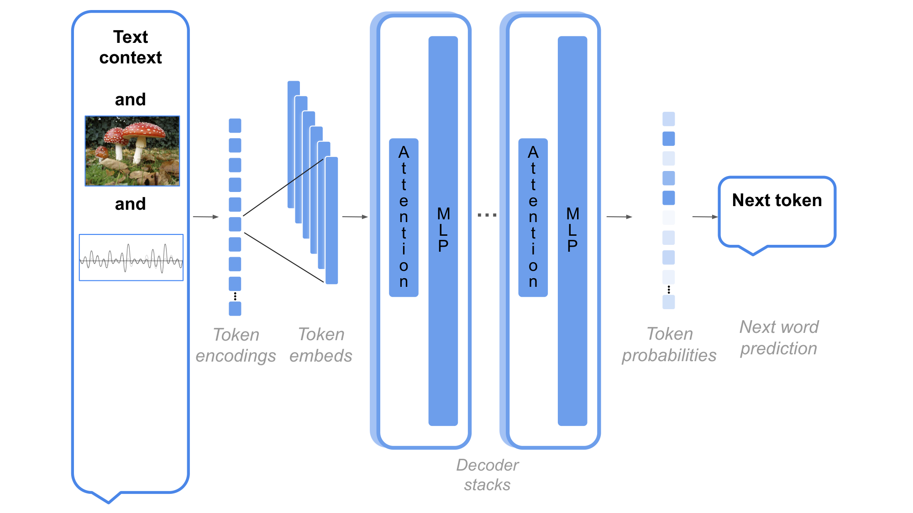

> "It's all about putting into context that crucial information that, when applied to attention, can actually do the thing that you need it to do." -- Jesse Spencer-Smith

---

## Tools: Augmenting the Model's Capabilities

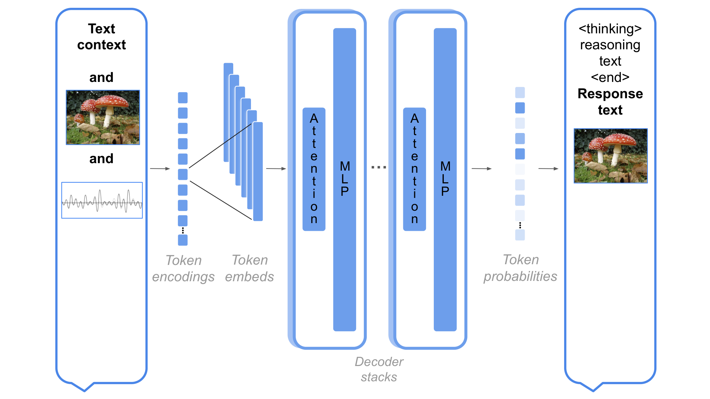

The capital of Washington State illustrates why tools matter. Most people's first instinct is "Seattle" -- and an LLM without tools would make a similar mistake, producing the most probable (but incorrect) answer. The correct answer is Olympia, and you know that because you can look it up.

**Tool use** means the model can produce special text that triggers external actions:
- **Internet search** -- Look up current facts
- **Calculator / Code execution** -- Perform precise math (the model struggles with arithmetic because numbers are tokenized in unintuitive ways -- "412" might be split into tokens "4" and "12")
- **Computer interaction** -- Write and run code in a sandboxed environment
- **MCP (Model Context Protocol)** -- Request data from external services in a standardized way
- **Skills** -- Load domain-specific process knowledge
- **RAG** -- Retrieve relevant document chunks (an older approach, now less common)

> "If the model is not augmented by tools, you ought not to be using it like Google. Because you're going to get the fuzzy JPEG answer." -- Jesse Spencer-Smith

### The Math Problem

Why do LLMs struggle with basic arithmetic despite running on computers? Because of tokenization. The number 412 might be tokenized as "4" (token 82) and "12" (token 93). The model must then try to combine these semantic embeddings to perform addition -- a nearly impossible task through embedding arithmetic alone. The solution: call a calculator, or write a small program and run it.

> "This is a very different kind of intelligence. And this is kind of a challenge that we never thought that we would see." -- Jesse Spencer-Smith

---

## Multimodal Models

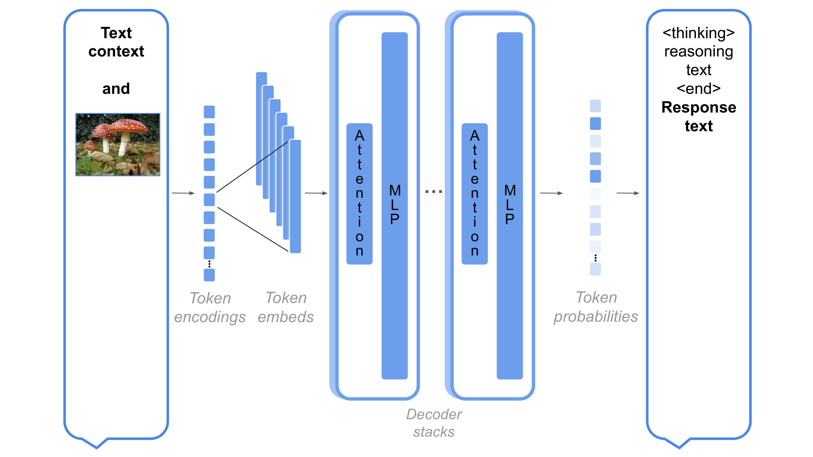

The transformer architecture is not limited to text. Images, audio, and video can all be tokenized and represented as embeddings. If the model was trained on multimodal data, it can process and generate across modalities. The same attention mechanism works regardless of whether the tokens represent words, image patches, or audio segments.

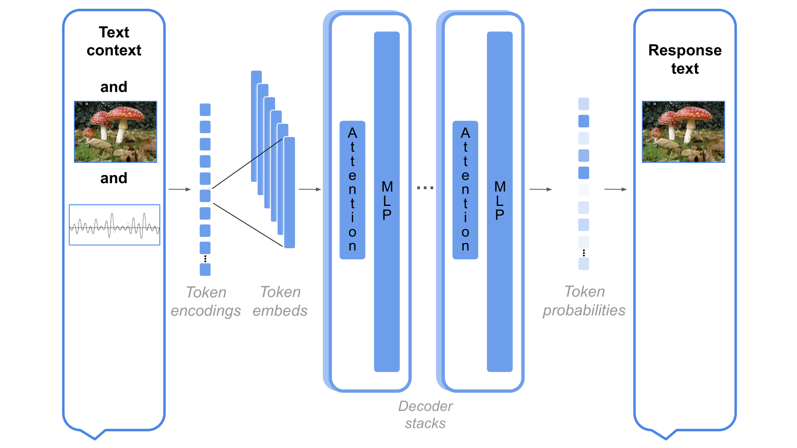

---

## What Is an Agent?

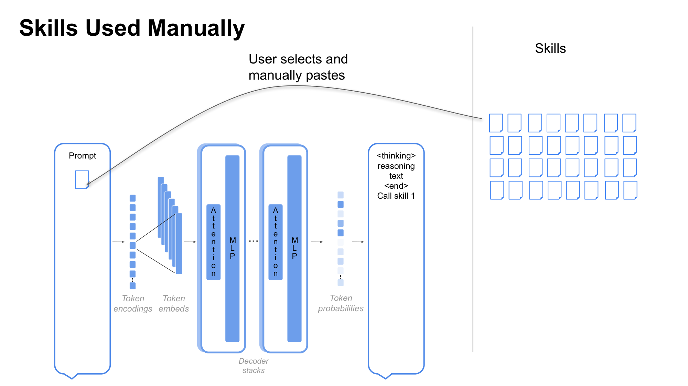

An **agent** is defined simply as:

**Model + Tools + Loop + Autonomy**

Unlike a single chat turn, an agent can:
- Pose a problem and work on it autonomously
- Run tools, assess results, and iterate
- Write code, execute it, check if it works, and fix errors in a loop
- Create external files (task lists, artifacts) to manage complex work
- Only report back when the task is complete

> "Tools plus autonomy gives you an agent." -- Jesse Spencer-Smith

### Deep Research as an Example

Deep research features (available in ChatGPT, Claude, Perplexity, etc.) are a specific type of agent on a very tight agentic loop. The agent searches broadly, follows references, assesses relevance, and synthesizes findings -- exactly mimicking how a human researcher would work, but at machine speed.

### The Agent Horizon

The **horizon** is how long an agent can work before losing the thread. This has grown dramatically: from minutes, to hours, and with careful orchestration, even weeks for very complex problems.

---

## Coding and Work Agents

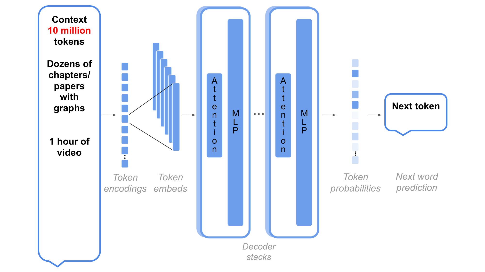

The most powerful recent development is giving agents access to your local computer environment -- your files, your software, your services, your work. Rather than operating in a sandboxed cloud environment, the agent can:

- Read and write files in your directories
- Install software it needs
- Write, run, and debug code locally
- Create artifacts (PowerPoints, Excel workbooks, documents) directly on your machine
- Operate in a closed loop: write code, test it, fix errors, repeat until it works

This provides **observability** -- you can trace what files the agent read, what code it ran, and what skills it applied. It is no longer model performance alone that matters, but the combination of **model and harness**.

> "It is no longer the case that one model is just better than another. It's the combination of model and harness." -- Jesse Spencer-Smith

---

## Skills: Encapsulated Expertise

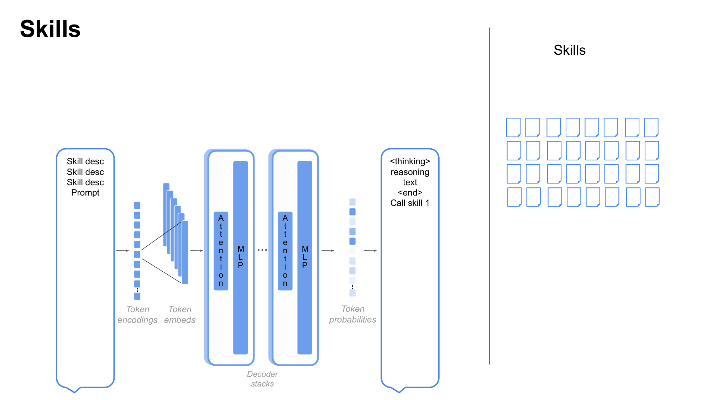

**Skills** address a fundamental problem: how does a model know the *right* way to do something for your specific domain?

The MLP knows all the different ways of doing things -- including all the wrong ways. Internet search might find any approach. **Skills** are human-authored Markdown documents that encode the preferred way to perform specific tasks for your lab, organization, or domain.

How skills work:
1. You ask the model to perform a task
2. The model first checks if a relevant skill exists
3. If found, the skill document is loaded into the prompt, right next to the task
4. Because the skill is in the context window near the task, attention acts on it directly
5. The model follows the skill's prescribed approach

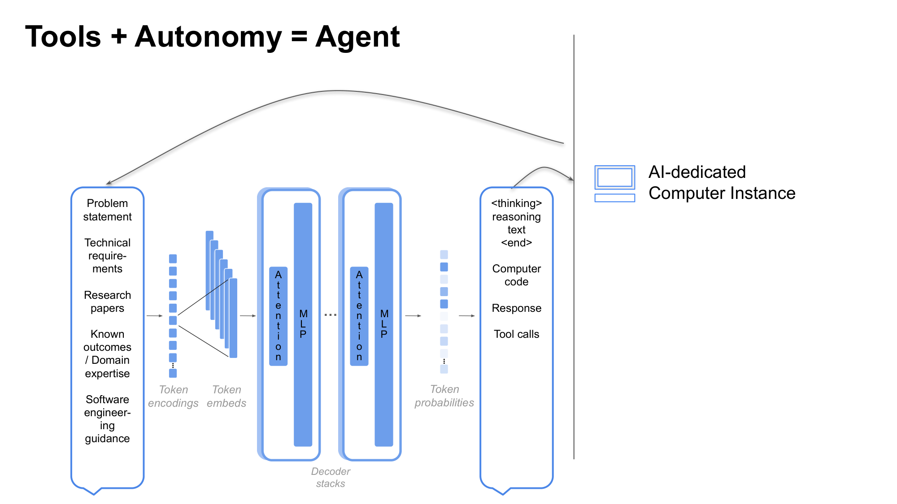

Skills can include pre-written code templates, step-by-step processes, domain-specific guidance, and quality criteria. They are human-readable Markdown files.

> "Skills work best when they are authored by a human and by an expert. Why? Because we're trying to figure out what the model does not know. If an AI writes a skill -- it already knew how to do that." -- Jesse Spencer-Smith

Skills serve several important purposes:
- **Traceability** -- You can see exactly what guidance the model received
- **Standardization** -- Work is done the same way every time
- **Human-in-the-loop** -- Domain experts contribute their knowledge to the process
- **Observability** -- Agent harnesses show which skills were loaded and when

---

## Working Memory: Human vs. Machine Intelligence

An important distinction between human and machine intelligence: humans can hold about 4-7 concepts in working memory at once. We use heuristics, chunking, and other cognitive strategies to reason about vast amounts of information.

The model operates differently. Its "intelligence" is crystalline -- the context window plus the token embeddings and the weights are all it has. There is no dynamic working memory, no heuristic reasoning in the human sense. You provide context, the model recalculates, and you get a new result.

> "Think of this intelligence as sort of crystalline. You add, you recalculate, and you get a new version. It does not anthropomorphize. It's different. It is a different type of intelligence than we are used to." -- Jesse Spencer-Smith

---

## Q&A

**Q (Audience):** How is MLP not database-driven?

**A (Jesse Spencer-Smith):** When you look at what a multi-layer perceptron actually is, it's a dense two-layer feed-forward network. The knowledge is stored in weight matrices -- there are no words there, no specific data to look up. The model does the math and returns an enrichment of the tokens. It is represented there, but there's no data to look up.

**Q (Audience):** What changed to make these models possible now when we've had neural nets since the 70s?

**A (Jesse Spencer-Smith):** Three things converged: (1) The attention mechanism and transformer architecture -- putting together known elements in a new way created a much better learner. (2) Sufficient compute -- training these models requires enormous computational power that simply did not exist before. (3) A new training methodology -- self-supervised learning on vast text corpora.

**Q (Audience):** What about mechanistic interpretability -- what are we still trying to figure out?

**A (Jesse Spencer-Smith):** Understanding what's happening is not going to come from examining the weights, because each weight informs many different things -- it's like a palimpsest, writing on writing on writing. Instead, researchers analyze the activations (the intermediate representations). This is an early but promising field. Vanderbilt is starting a generative AI graduate certificate for those who want to go deeper.

**Q (Audience):** What about post-training and fine-tuning?

**A (Jesse Spencer-Smith):** Pre-training (guessing the next word on massive text) is where the model learns language, semantics, and world knowledge. Alignment comes after: it teaches the model about questions, tasks, safe responses, and helpfulness through supervised fine-tuning and reinforcement learning. ChatGPT's breakthrough was aligning the model to understand queries and respond as a conversational agent.

**Q (Audience):** If the model can reproduce long segments of text exactly, doesn't that contradict the "fuzzy JPEG" idea?

**A (Jesse Spencer-Smith):** If you train enough on a particular text (especially high-quality text trained on multiple times), it can be stored strongly enough to reproduce nearly verbatim. That represents the "sharp part" of the fuzzy JPEG. But this cannot happen for everything -- there is not enough room to store it all precisely.

**Q (Audience):** How do we know when model outputs are correct vs. incorrect?

**A (Jesse Spencer-Smith):** The model always produces something with high probability -- something plausible. Without tools, it only has the fuzzy JPEG. This is why tool augmentation is so important: tools provide ground truth that the model can incorporate into its context.

**Q (Audience):** What about deep research features in ChatGPT, Claude, and Perplexity?

**A (Jesse Spencer-Smith):** Deep research is a specialized agent on a very tight agentic loop with advanced search capabilities. It mimics what a human researcher does: searches broadly, follows references, assesses relevance, identifies when it is not finding new information, and then synthesizes findings into a usable form.

---

## Summary

- Generative AI models are **decoder transformers** that predict the next token autoregressively, using attention to weigh context and MLPs to store learned world knowledge
- Token embeddings place words in a semantic space where locations have meaning, enabling mathematical operations on concepts
- The MLP acts as a **"fuzzy JPEG of the world"** -- a lossy compression of training data, not a precise database
- Models always produce **plausible** output; without tools, they cannot guarantee accuracy -- "hallucination" is their fundamental operating mode
- **Reasoning models** add an internal monologue (thinking tokens) before responding, enabling more considered answers
- **Tools** (search, code execution, MCP) ground model outputs in verified information and extend capabilities beyond the training data
- **Context windows** have grown to 1M+ tokens, dramatically improving performance when relevant information is provided
- An **agent** = model + tools + loop + autonomy; agents can work for hours on complex problems
- **Skills** (human-authored Markdown documents) encode domain expertise into the model's workflow, providing traceability, standardization, and human guidance
- This is a **different type of intelligence** -- crystalline rather than dynamic -- and should not be anthropomorphized

## References

- "Attention Is All You Need" (2017) -- Google, the foundational paper introducing the transformer architecture
- "Formal Algorithms for Transformers" -- Academic paper containing Algorithm 10 (the decoder-only transformer pseudocode shown during the session)
- *Natural Language Processing with Transformers* (2022) by Lewis Tunstall, Leandro von Werra, and Thomas Wolf -- Basis for the transformer architecture visualizations used in the slides
- Zora Neale Hurston, *Their Eyes Were Watching God* -- Source of the example sentence used to demonstrate self-supervised learning
- George Miller -- Referenced for the "7 plus or minus 2" working memory capacity finding
- Herbert Simon -- Referenced for the revised estimate of ~4 items in working memory
- Vanderbilt University Generative AI Graduate Certificate -- Mentioned as an upcoming program for deeper study
